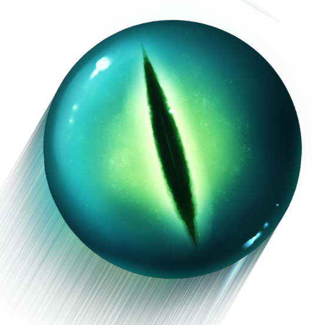

<a name="readme-top"></a>

<br />
<div align="center">
  <a href="https://github.com/Turbocube/turbocube.fr">
    
  </a>

  <h3 align="center">Turbocube website</h3>

  <p align="center">
    The turbocube minercraft server website!
    <br />
    <a href="https://turbocube.fr/">View Demo</a>
    ·
    <a href="https://github.com/Turbocube/turbocube.fr/issues">Report Bug</a>
    <br />
    <br />
    <br />
  </p>
</div>

<details>
  <summary>Table of Contents</summary>
  <ol>
    <li>
      <a href="#getting-started">Getting Started</a>
      <ul>
        <li><a href="#installation">Installation</a></li>
        <li><a href="#usage">Usage</a></li>
      </ul>
    </li>
    <li><a href="#contributing">Contributing</a></li>
    <li><a href="#license">License</a></li>
    <li><a href="#contact">Contact</a></li>
    <li><a href="#acknowledgments">Acknowledgments</a></li>
  </ol>
</details>

## About The Project


We came up with the idea of this server to keep track of our Minecraft adventures.

Tired of recreating a new world every time you start a new survival or of losing your old worlds?
Then Turbocube is for you!

This website is desined to display cool informations about the Minecraft like the status, players online but also:
* 👜 Inventory: Retrieve and save Turbocube player inventories.
* 🗺️ Map: Minecraft's Google maps give you a 2D and 3D map of Turbocube.
* 👤 About us: Just a simple about us page

<p align="right">(<a href="#readme-top">back to top</a>)</p>

## Getting Started

Follow these steps to get the Turbocube website running on your local machine.

### Installation

1. Clone the repo

   ```sh
   git clone https://github.com/Turbocube/turbocube.fr.git
   ```

2.  Make sure you have node.js (<https://nodejs.org/en/>) installed

3.  Install all packages
    ```
    npm install
    ```

### Usage

To build your website you can just do `npm run build` or run in terminal with:
```
npm start
```

_For more details, please refer to the [Paper Kit Documentation](https://demos.creative-tim.com/paper-kit-react/#/documentation/introduction?ref=pkr-github-readme)_

<p align="right">(<a href="#readme-top">back to top</a>)</p>

## Contributing

Contributions are what make the open source community such an amazing place to learn, inspire, and create. Any contributions you make are **greatly appreciated**.

If you have a suggestion that would make this better, please fork the repo and create a pull request. You can also simply open an issue with the tag "enhancement".
Don't forget to give the project a star! Thanks again!

1. Fork the Project
2. Create your Feature Branch (`git checkout -b feature/AmazingFeature`)
3. Commit your Changes (`git commit -m 'Add some AmazingFeature'`)
4. Push to the Branch (`git push origin feature/AmazingFeature`)
5. Open a Pull Request

<p align="right">(<a href="#readme-top">back to top</a>)</p>

## License

Distributed under the MIT License. See `LICENSE.txt` for more information.

<p align="right">(<a href="#readme-top">back to top</a>)</p>

## Contact

Alexis Knob - alexis@bonko.fr

Project Link: [https://github.com/Turbocube](https://github.com/Turbocube)

<p align="right">(<a href="#readme-top">back to top</a>)</p>

## Acknowledgments

Special thanks to the following resources and tools that have made this project possible:

* [DynMap](https://www.spigotmc.org/resources/dynmap%C2%AE.274/)
* [Inventory Chasem](https://inventories.chasem.dev/)
* [Paper Kit React](https://www.creative-tim.com/product/paper-kit-react)


| HTML | Angular | React |
| --- | --- | --- |
| [](https://www.creative-tim.com/product/paper-kit-2?ref=pkr-github-readme)  | [](https://www.creative-tim.com/product/paper-kit-2-angular?ref=pkr-github-readme)  | [](https://www.creative-tim.com/product/paper-kit-react?ref=pkr-github-readme)  

| Register Page | Landing Page | Profile Page  |
| --- | --- | ---  |
| [](https://demos.creative-tim.com/paper-kit-react/#/register-page?ref=pkr-github-readme)  | [](https://demos.creative-tim.com/paper-kit-react/#/landing-page?ref=pkr-github-readme)  | [](https://demos.creative-tim.com/paper-kit-react/#/profile-page?ref=pkr-github-readme)  

[View More](https://demos.creative-tim.com/paper-kit-react/#/index?ref=pkr-github-readme)


<p align="right">(<a href="#readme-top">back to top</a>)</p>